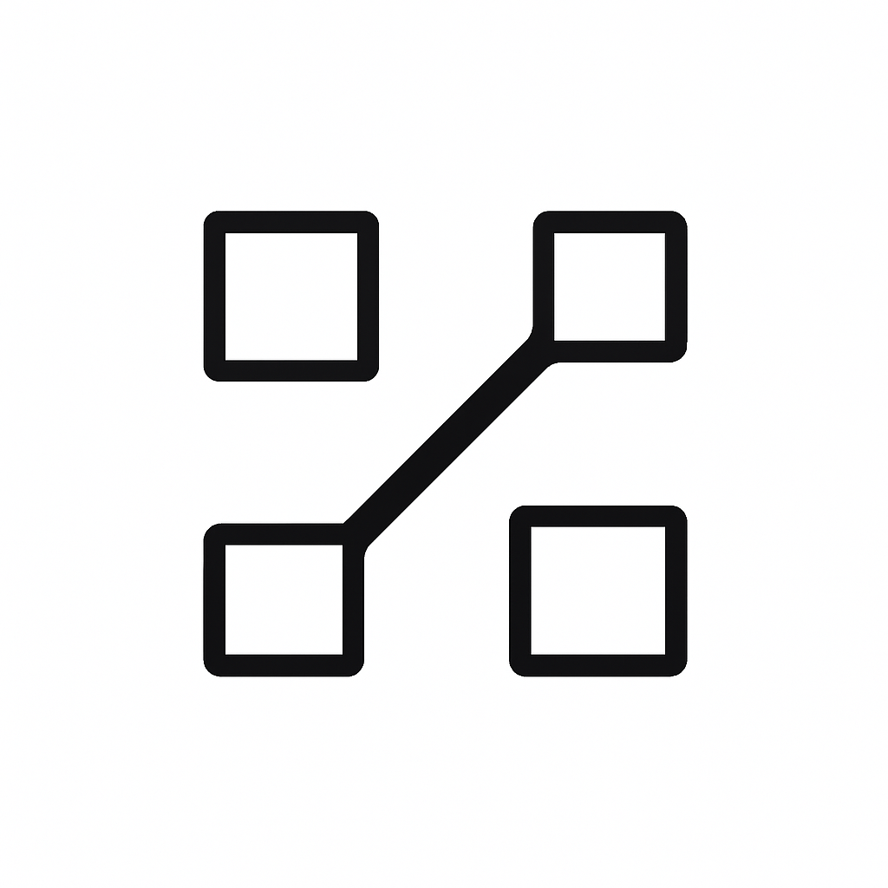
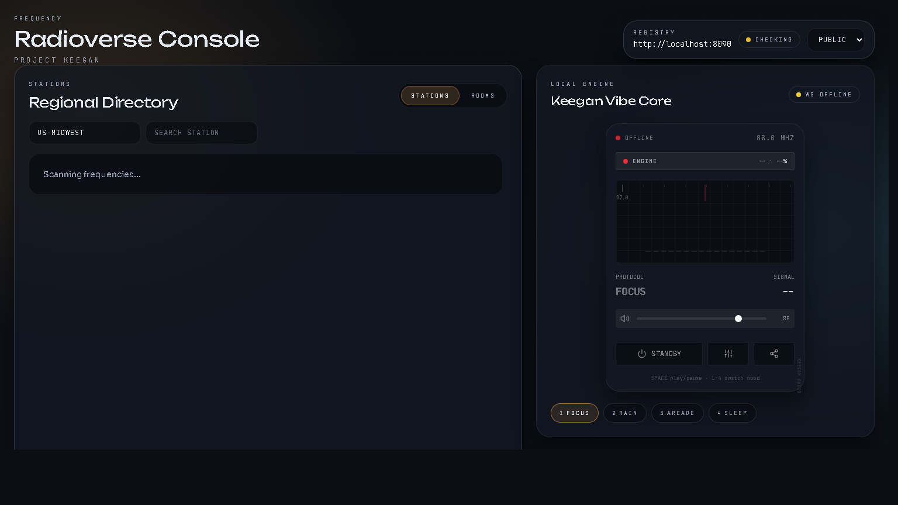

# Frequency (powered by Keegan)



Frequency is the listener-facing name for Keegan - a tray-first local radio engine that weaves moods instead of playlists. It lives in the Windows system tray, runs offline, and drifts through stems, procedural synth, and tiny whispered stories.

Website (local registry UI): http://localhost:8090/  
Website (production): https://keegan-khaki.vercel.app  
Registry (production): https://keegan-qkgq.onrender.com

## Visuals


## What this is / what this isn't
**This is:** a local-first radio engine + directory where people can host stations and listeners can tune in.  
**This isn't:** a music streaming service or a social network with feeds.

## Start here (host a station first)
This flow gets a live station visible in the directory.

Shortcut (starts registry + web, and EXE if built):
```powershell
.\start_dev.ps1
```

1) **Start the registry (the directory).**
```bash
cd ai_radio/server
python registry_server.py
```
Open the directory UI: http://localhost:8090/

2) **Start the web console (the listener view + ingest control).**
```bash
cd ai_radio/web
npm install
npm run dev
```
Open: http://localhost:5173/

3) **Build + run the engine (the EXE).**
```bash
cd ai_radio
cmake -S . -B build
cmake --build build --config Release
```
Run from the repo root so it can serve `web/dist`:
```
ai_radio/build/Release/keegan_patched.exe
```

4) **Go live.**
- In the web console, open **Ingest Control**.
- Generate a token and use the RTMP URL in your encoder (see `server/ingest/README.md`).

5) **If the directory doesn't load:**
- Check http://localhost:8090/health returns `{ ok: true, ... }`.
- Make sure the registry allows your UI origin (`ALLOWED_ORIGINS` in `server/README.md`).
- The UI shows the exact failure reason next to the REGISTRY label.

Tip: Use the **Registry** selector in the header to switch between Public, Local, Mixed, or Custom registries.

## Deploy (public website + registry)
This repo includes deploy configs for a hosted demo using Vercel (web UI), Render (registry), and Fly (MediaMTX ingest).

See [DEPLOY.md](DEPLOY.md) for full setup instructions.

Current Endpoints:
- **Backend (Registry)**: https://keegan-qkgq.onrender.com
- **Frontend (Console)**: *Pending Vercel Deployment*

1) **Registry on Render**
   - Uses `render.yaml` (root).
   - Env:
    - `ALLOWED_ORIGINS=https://keegan-khaki.vercel.app,http://localhost:5173`
    - `KEEGAN_REGISTRY_KEY` (optional, protects POST)
    - `KEEGAN_INGEST_SECRET` (required for web-host tokens)
    - `KEEGAN_INGEST_RTMP_BASE` (Fly RTMP)
    - `KEEGAN_INGEST_HLS_BASE` (Fly HLS)
    - `KEEGAN_INGEST_WEBRTC_BASE` (Fly WebRTC)
    - `KEEGAN_TELEMETRY=1` (optional)

2) **Web UI on Vercel**
   - Set root directory to `ai_radio/web`.
   - Env:
    - `VITE_REGISTRY_URL=https://keegan-qkgq.onrender.com`
     - `VITE_REGISTRY_KEY` (optional)
     - `VITE_BRIDGE_URL` / `VITE_BRIDGE_KEY` if you are wiring a local EXE bridge

Tip: `ALLOWED_ORIGINS` supports wildcard subdomains like `*.vercel.app` if you want to keep preview URLs open.

3) **Ingest on Fly**
   - Use `ai_radio/ingest` as the Fly working directory.
   - Deploy MediaMTX and point your registry env vars to the Fly hostname.

## Troubleshooting (quick)
- **Registry offline:** verify `python registry_server.py` is running and port 8090 is free.
- **CORS errors:** add your UI origin to `ALLOWED_ORIGINS` in the registry env.
- **No audio:** confirm the EXE is running and `web/dist` exists.

## Listen now (no hosting required)
If you just want to listen:
```bash
cd ai_radio/web
npm install
npm run dev
```
Open http://localhost:5173/ and pick a station from the Regional Directory.

## What it does
- Tray controls: play/pause, intensity, mood select (Focus Room, Rain Cave, Arcade Night, Sleep Ship).
- Mood brain: state machine with smooth transitions, personality drift over days, active-app weighting (IDE biases focus, games bias arcade, media/idle bias sleep/rain).
- Audio engine: miniaudio-based mixer with layer scheduler, gentle crossfades, per-layer filters, ducked TTS/voice bus, and lightweight plate-style reverb.
- Content: bundled stems plus procedural synth; micro-stories come from a prewritten list for MVP.

## Host a station (local)
If you want to broadcast your own "frequency," the web console handles tokens and URLs for you. See `server/ingest/README.md` for the RTMP wiring.

## Telemetry (opt-in)
Telemetry is **off by default**.
- EXE: set `KEEGAN_TELEMETRY=1` to log JSONL to `cache/telemetry.jsonl`.
- Registry: set `KEEGAN_TELEMETRY=1` to log JSONL to `server/data/telemetry-YYYY-MM-DD.jsonl`.

Quick summary:
```bash
python ai_radio/tools/telemetry_summary.py
```

## Open source and modding
- Keegan is designed as a moddable radio engine. Frequency packs can replace moods, stems, and tuning curves.
- See `docs/MODDING_GUIDE.md` and `mods/example_neon` for the pack format.

## Security
- Set `KEEGAN_BRIDGE_KEY` to protect local POST endpoints.
- Set `KEEGAN_BROADCAST_SECRET` to sign per-station ingest tokens (defaults to bridge key).
- Set `KEEGAN_REGISTRY_KEY` to protect registry POST endpoints.

## Config knobs (quick)
- Web UI: `VITE_REGISTRY_URL` (default `http://localhost:8090`), `VITE_REGISTRY_KEY` (optional), `VITE_BRIDGE_URL` (default `http://localhost:3000`), `VITE_BRIDGE_KEY` (optional)
- Registry: `ALLOWED_ORIGINS` (comma-separated, default allows localhost ports), `KEEGAN_TELEMETRY=1` (enable JSONL telemetry logging)
- Web ingest: `KEEGAN_INGEST_SECRET`, `KEEGAN_INGEST_RTMP_BASE`, `KEEGAN_INGEST_HLS_BASE`, `KEEGAN_INGEST_WEBRTC_BASE`

## Repo map
- `assets/` - logo and bundled stems/tones (includes Sleep Ship placeholders and synth preset).
- `config/` - mood pack JSON including Sleep Ship.
- `src/` - Keegan C++ sources (brain, DSP, state machine).
- `web/` - Radioverse Console UI.
- `server/` - station registry service + minimal directory UI.
- `docs/` - specs and platform docs.
- `mods/` - frequency packs (modding).

## Product specs
- `docs/RADIOVERSE_SPEC.md` - full platform vision and architecture.
- `docs/LOCAL_BRIDGE_API.md` - local API between EXE and web.
- `docs/REGISTRY_API.md` - station registry API and directory.
- `docs/STATION_HOSTING_SPEC.md` - how to host a station and join the directory.
- `docs/ROADMAP.md` - milestones for shipping the platform.

## Design notes (alpha)
- Aesthetic: Focus amber, Rain blue, Arcade neon magenta, Sleep indigo.
- Audio feel: smooth equal-power fades, quiet micro-stories with ducking, light plate reverb (low-cut), no clipping (soft limiter).
- Mood textures: Focus (ticks/wood/paper), Rain (water/air/stone), Arcade (muted bass + bleeps), Sleep (engine/hiss/creaks).

## Density curves (per mood)
- Focus Room: slow S-curve (0.35 -> 0.55) with tiny +/-0.05 wobble every ~90s.
- Rain Cave: low-flat (0.25-0.4) with occasional dips to 0.15 for space.
- Arcade Night: rising ramp (0.4 -> 0.75 over 4-6 min) then micro-drops every 30-45s.
- Sleep Ship: low plateau (0.15-0.25) with rare swells to 0.35 and long releases.

## DSP polish targets
- Reverb: light plate/FDN hybrid, pre-delay 20-60ms, damped high shelf, modulated decay; wet mapped to warmth/tension per mood.
- Ducking: sidechain compressor keyed by voice/TTS bus; attack 10-20ms, release 300-500ms, gentle ratio ~2.5:1.
- Crossfades: equal-power fades for swaps and tempo-aware loop points; keep tails to avoid holes during transitions.

## Inputs the brain watches
- Time of day, keyboard/mouse intensity, user intensity slider.
- Foreground app heuristics: regex table -> mood/energy biases, evaluated every few seconds with smoothing.
- Random seeds to keep recipes alive and allow rare surprises.
